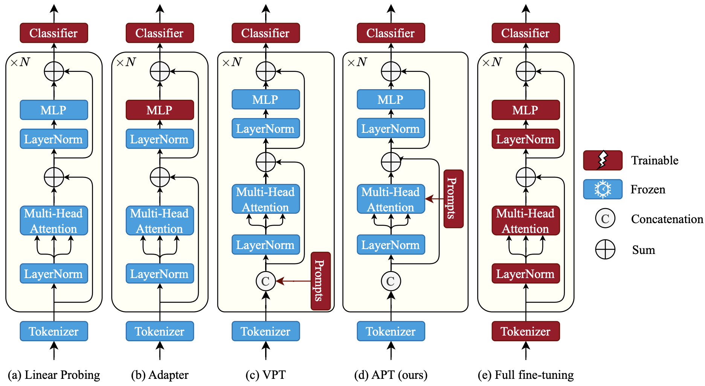

# APT: Attention Prompt Tuning

> [**APT: Attention Prompt Tuning**](https://arxiv.org/abs/xxxx)<br>

> A Parameter-Efficient Adaptation of Pre-Trained Models for Action Recognition ...

> [Wele Gedara Chaminda Bandara](https://github.com/wgcban), [Vishal M Patel](https://engineering.jhu.edu/vpatel36/team/vishalpatel/)<br>Johns Hopkins University

> Accepted at [FG'24](https://fg2024.ieee-biometrics.org)



## Getting Started

### Conda Environment

Setup the virtual conda environment using the `environment.yml`:
```
conda env create -f environment.yml
```

Then activate the conda environment:
```
conda activate apt
```

### Download the VideoMAE Pre-trained Models:

We use [VideoMAE](https://github.com/MCG-NJU/VideoMAE) pretrianed on [Kinetics-400](https://github.com/cvdfoundation/kinetics-dataset) dataset for our experiments.

The pre-trained models for ViT-Small and ViT-Base backbones can be downloaded from below links:

|  Method  | Extra Data | Backbone | Epoch | \#Frame |                          Pre-train                           |
| :------: | :--------: | :------: | :---: | :-----: | :----------------------------------------------------------: |
| VideoMAE |  ***no***  |  ViT-S   |  1600  | 16x5x3  | [checkpoint](https://drive.google.com/file/d/1nU-H1u3eJ-VuyCveU7v-WIOcAVxs5Hww/view?usp=sharing) |
| VideoMAE |  ***no***  |  ViT-B   | 1600  | 16x5x3  | [checkpoint](https://drive.google.com/file/d/1tEhLyskjb755TJ65ptsrafUG2llSwQE1/view?usp=sharing) |

If you need other pre-trained models please refer [MODEL_ZOO.md](https://github.com/wgcban/apt/blob/main/MODEL_ZOO.md).

## ✏️ Citation

If you think this project is helpful, please feel free to leave a star⭐️ and cite our paper:

```
@inproceedings{tong2022videomae,
  title={Video{MAE}: Masked Autoencoders are Data-Efficient Learners for Self-Supervised Video Pre-Training},
  author={Zhan Tong and Yibing Song and Jue Wang and Limin Wang},
  booktitle={Advances in Neural Information Processing Systems},
  year={2022}
}

@article{videomae,
  title={VideoMAE: Masked Autoencoders are Data-Efficient Learners for Self-Supervised Video Pre-Training},
  author={Tong, Zhan and Song, Yibing and Wang, Jue and Wang, Limin},
  journal={arXiv preprint arXiv:2203.12602},
  year={2022}
}
```
