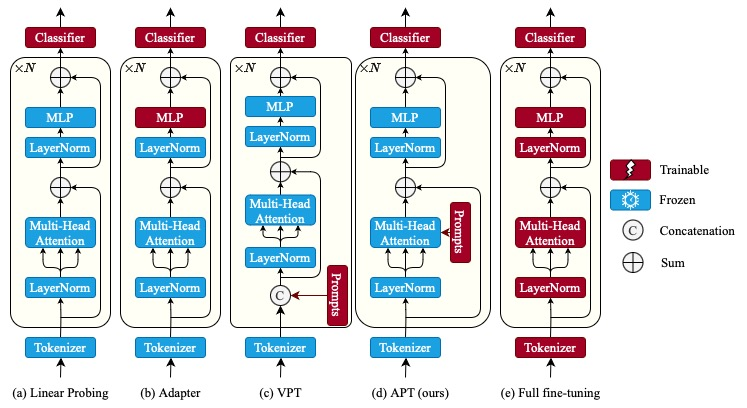
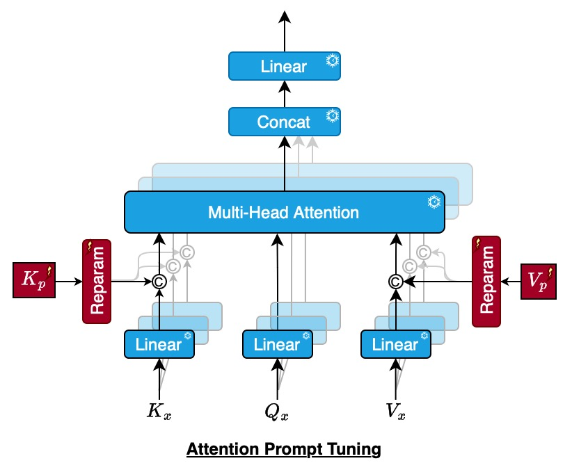

# APT: Attention Prompt Tuning
> A Parameter-Efficient Adaptation of Pre-Trained Models for Action Recognition ...<br>

> [Wele Gedara Chaminda Bandara](https://github.com/wgcban), [Vishal M Patel](https://engineering.jhu.edu/vpatel36/team/vishalpatel/)<br>Johns Hopkins University

> Accepted at [FG'24](https://fg2024.ieee-biometrics.org)

> [Paper (on ArXiv)](https://arxiv.org/abs/2403.06978)<br>



*Comparison of our Attention Prompt Tuning (APT) for videos action classification with other existing tuning methods:  linear probing, [adapter tuning](https://arxiv.org/abs/2205.13535), [visual prompt tuning (VPT)](https://arxiv.org/abs/2203.12119), and full fine-tuning.*




*Attention Prompt Tuning (APT) injects learnable prompts directly into the MHA unlike VPT.*

## Getting Started

### Step 1: Conda Environment

Setup the virtual conda environment using the `environment.yml`:
```
conda env create -f environment.yml
```

Then activate the conda environment:
```
conda activate apt
```

### Step 2: Download the VideoMAE Pre-trained Models:

We use [VideoMAE](https://github.com/MCG-NJU/VideoMAE) pretrianed on [Kinetics-400](https://github.com/cvdfoundation/kinetics-dataset) dataset for our experiments.

The pre-trained models for ViT-Small and ViT-Base backbones can be downloaded from below links:

|  Method  | Extra Data | Backbone | Epoch | \#Frame |                          Pre-train                           |
| :------: | :--------: | :------: | :---: | :-----: | :----------------------------------------------------------: |
| VideoMAE |  ***no***  |  ViT-S   |  1600  | 16x5x3  | [checkpoint](https://drive.google.com/file/d/1nU-H1u3eJ-VuyCveU7v-WIOcAVxs5Hww/view?usp=sharing) |
| VideoMAE |  ***no***  |  ViT-B   | 1600  | 16x5x3  | [checkpoint](https://drive.google.com/file/d/1tEhLyskjb755TJ65ptsrafUG2llSwQE1/view?usp=sharing) |

If you need other pre-trained models please refer [MODEL_ZOO.md](https://github.com/wgcban/apt/blob/main/MODEL_ZOO.md).

### Step 3: Download the datasets

We conduct experiments on three action recognition datasets: 1) UCF101 2) HMDB51 3) Something-Something-V2. 

Please refer [DATASETS.md](https://github.com/wgcban/apt/blob/main/DATASET.md) for access to those links and pre-processing steps.

### Step 4: Attention Prompt Tuning

We provide example scripts to run the attention prompt tuning on UCF101, HMDB51, and SSv2 datasets in `scripts/` folder.

Inside `scripts/` you can find two folders which corresponds to APT finetuning with ViT-Small and ViT-Base architectures. 

To fine-tune with APT you just need to execute `finetune.sh` file -- which will launch the job with distributed training by


For example, to fine-tune ViT-Base on SSv2 with APT, you may run:
```
sh scripts/ssv2/vit_base/finetune.sh
```

The `finetune.sh` looks like this:

```bash
# APT on SSv2
OUTPUT_DIR='experiments/APT/SSV2/ssv2_videomae_pretrain_base_patch16_224_frame_16x2_tube_mask_ratio_0.9_e2400/adam_mome9e-1_wd1e-5_lr5se-2_pl2_ps0_pe11_drop10'
DATA_PATH='datasets/ss2/list_ssv2/'
MODEL_PATH='experiments/pretrain/ssv2_videomae_pretrain_base_patch16_224_frame_16x2_tube_mask_ratio_0.9_e2400/checkpoint.pth'

NCCL_P2P_DISABLE=1 OMP_NUM_THREADS=1 CUDA_VISIBLE_DEVICES=0,1,3,4,5,6,7,8 python -m torch.distributed.launch --nproc_per_node=8 \
    run_class_apt.py \
    --model vit_base_patch16_224 \
    --transfer_type prompt \
    --prompt_start 0 \
    --prompt_end 11 \
    --prompt_num_tokens 2 \
    --prompt_dropout 0.1 \
    --data_set SSV2 \
    --nb_classes 174 \
    --data_path ${DATA_PATH} \
    --finetune ${MODEL_PATH} \
    --log_dir ${OUTPUT_DIR} \
    --output_dir ${OUTPUT_DIR} \
    --batch_size 8 \
    --batch_size_val 8 \
    --num_sample 2 \
    --input_size 224 \
    --short_side_size 224 \
    --save_ckpt_freq 10 \
    --num_frames 16 \
    --opt adamw \
    --lr 0.05 \
    --weight_decay 0.00001 \
    --epochs 100 \
    --warmup_epochs 10 \
    --test_num_segment 2 \
    --test_num_crop 3 \
    --dist_eval \
    --pin_mem \
    --enable_deepspeed \
    --prompt_reparam \
    --is_aa \
    --aa rand-m4-n2-mstd0.2-inc1

```

Here,

- `OUTPUT_DIR`: place where you wants to save the results (i.e., logs and checkpoints)
- `DATA_PATH`: path to where the dataset is stored
- `MODEL_PATH`: path to the downloaded videomae pre-trained model
- specifiy thich gpus (gpu ids) you wants to use for finetuning in `CUDA_VISIBLE_DEVICES=`...
- `nproc_per_node` is the number of gpus using for fine-tuning
- `model` is the vit-base (vit_base_patch16_224) or vit-small (vit_small_patch16_224)
- `transfer_type` specifies which finetuning method to use. 'random' means random initialization, 'end2end' means full end-to-end fine tuning, 'prompt' means APT (ours), 'linear' means linear probing
- `prompt_start` refers to starting trasnformer block where you add attention prompts. 0 means you start adding learninable prompts from 1st transformer block in vit
- `prompt_end` refers to ending trasformer block where you stop adding attention prompts. vit-base / vit-small has 12 transformer blocks. hence 11 here means you add prompts until last trasnformer block
- `data_set` specifies the dataset
- * all the other parameters are hyperparamters related to apt fine-tuning. 


## ✏️ Citation

If you think this project is helpful, please feel free to leave a star⭐️ and cite our paper:

```

```


## ✏️ Disclaimer

This repocitory is built on top of VideoMAE: https://github.com/MCG-NJU/VideoMAE codebase and we approcite the authors of VideoMAE for making their codebase publically available.
